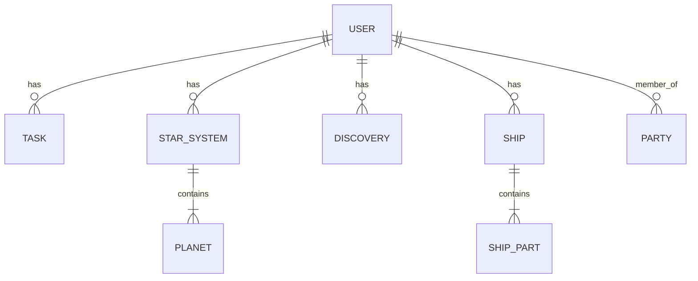

# Galaxify Data Model

**Status**: Draft

This document defines the data entities for the Galaxify project based on the feature specification.

## Entity Relationship Diagram (Conceptual)

## Entity Definitions

### User
Represents a player in the game. It is the central entity that owns most other data.
- **Fields**:
  - `userId` (Primary Key)
  - `email` (String, Unique, Required)
  - `passwordHash` (String, Required)
  - `createdAt` (Timestamp)
  - `updatedAt` (Timestamp)

### Task
A real-world activity a user wants to track.
- **Fields**:
  - `taskId` (Primary Key)
  - `user` (Foreign Key to User)
  - `type` (Enum: 'HABIT', 'DAILY', 'TODO', Required)
  - `text` (String, Required)
  - `notes` (String)
  - `isPositive` (Boolean, Default: true)
  - `isNegative` (Boolean, Default: false)
  - `completed` (Boolean, Default: false)
  - `streak` (Number, Default: 0)
  - `createdAt` (Timestamp)
  - `updatedAt` (Timestamp)

### Ship
The user's spaceship, which can be customized.
- **Fields**:
  - `shipId` (Primary Key)
  - `user` (Foreign Key to User, Unique)
  - `name` (String, Default: 'UNS Pioneer')
  - `partSlots` (Number, Default: 4)
  - `parts` (Array of Embedded **ShipPart**)

### ShipPart (Embedded in Ship)
- **Fields**:
  - `name` (String, Required)
  - `type` (Enum: 'SCANNER', 'ENGINE', 'MINING_LASER', Required)
  - `description` (String)
  - `effects` (Array of Objects, e.g., `{ "effectType": "REWARD_BONUS", "value": 0.05 }`)

### StarSystem
A user's personal, procedurally generated star system.
- **Fields**:
  - `systemId` (Primary Key)
  - `user` (Foreign Key to User)
  - `name` (String, Required)
  - `isCurrent` (Boolean, Default: true)
  - `planets` (Array of Embedded **Planet**)

### Planet (Embedded in StarSystem)
- **Fields**:
  - `planetId` (Primary Key)
  - `name` (String, Required)
  - `description` (String)
  - `discoveredAt` (Timestamp)

### Discovery
A persistent record of a user's discoveries across all systems.
- **Fields**:
  - `discoveryId` (Primary Key)
  - `user` (Foreign Key to User)
  - `type` (Enum: 'PLANET', 'CREATURE', 'LORE', Required)
  - `name` (String, Required)
  - `description` (String)
  - `discoveredAt` (Timestamp)

### Party
A group of users for social features.
- **Fields**:
  - `partyId` (Primary Key)
  - `name` (String, Required)
  - `members` (Array of Foreign Keys to User)
  - `activeEvent` (String) 
